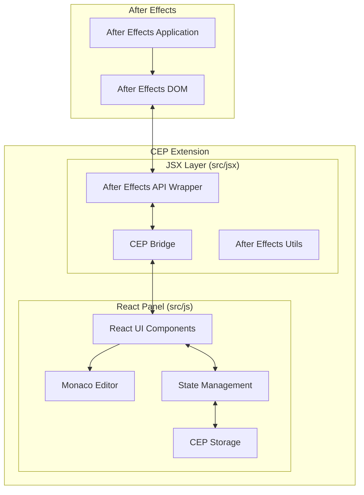

# Design Document

## Overview

本設計では、既存のbolt-cepプロジェクト構造を活用し、ReactベースのパネルUI（src/js）とAfter Effects JSX拡張（src/jsx）間のCEPブリッジ通信を通じて、VSCodeライクなコードエディタ機能を実装します。Monaco Editorを中核とした高機能エディタを提供し、レイヤーコメント編集、一時メモ機能、エクスプレッション編集の強化を実現します。

## Architecture

### High-Level Architecture



### Communication Flow

1. **UI Interaction**: ユーザーがReactパネルで操作
2. **State Update**: React state managementで状態更新
3. **CEP Bridge**: JSXレイヤーとの通信
4. **After Effects API**: JSXがAfter Effects DOMを操作
5. **Persistence**: CEP storageで設定・データ永続化

## Components and Interfaces

### React Panel Components (src/js/main/)

#### 1. Main Editor Container

```typescript
interface EditorContainerProps {
  mode: "comment" | "note" | "expression";
  selectedLayer?: Layer;
  selectedProperty?: Property;
}

interface EditorState {
  content: string;
  isDirty: boolean;
  language: string;
  errors: EditorError[];
}
```

#### 2. Monaco Editor Wrapper

```typescript
interface MonacoEditorProps {
  value: string;
  language: "javascript" | "plaintext";
  onChange: (value: string) => void;
  onSave: () => void;
  options: MonacoEditorOptions;
}

interface MonacoEditorOptions {
  theme: "vs-dark" | "vs-light";
  fontSize: number;
  wordWrap: boolean;
  minimap: boolean;
  autoFormat: boolean;
  linting: boolean;
}
```

#### 3. Layer Comment Editor

```typescript
interface CommentEditorProps {
  layerId: string;
  initialComment: string;
  onSave: (comment: string) => Promise<void>;
  onCancel: () => void;
}
```

#### 4. Notes Manager

```typescript
interface Note {
  id: string;
  title: string;
  content: string;
  category?: string;
  createdAt: Date;
  updatedAt: Date;
}

interface NotesManagerProps {
  notes: Note[];
  onCreateNote: (note: Omit<Note, "id" | "createdAt" | "updatedAt">) => void;
  onUpdateNote: (id: string, updates: Partial<Note>) => void;
  onDeleteNote: (id: string) => void;
}
```

#### 5. Expression Editor

```typescript
interface ExpressionEditorProps {
  propertyPath: string;
  initialExpression: string;
  onApply: (expression: string) => Promise<void>;
  onValidate: (expression: string) => ValidationResult;
}

interface ValidationResult {
  isValid: boolean;
  errors: ExpressionError[];
  warnings: ExpressionWarning[];
}
```

### JSX Layer Interfaces (src/jsx/)

#### 1. CEP Bridge Communication

```typescript
interface CEPBridge {
  // Layer operations
  getSelectedLayers(): LayerInfo[];
  getLayerComment(layerId: string): string;
  setLayerComment(layerId: string, comment: string): boolean;

  // Expression operations
  getPropertyExpression(propertyPath: string): string;
  setPropertyExpression(propertyPath: string, expression: string): boolean;
  validateExpression(expression: string): ValidationResult;

  // Project operations
  getAllExpressions(): ExpressionInfo[];
  searchExpressions(pattern: string, isRegex: boolean): SearchResult[];
}
```

#### 2. After Effects API Wrapper

```typescript
interface LayerInfo {
  id: string;
  name: string;
  comment: string;
  index: number;
  selected: boolean;
}

interface PropertyInfo {
  path: string;
  name: string;
  expression: string;
  hasExpression: boolean;
  propertyType: string;
}

interface ExpressionInfo {
  layerName: string;
  propertyPath: string;
  expression: string;
  lineCount: number;
}
```

## Data Models

### 1. Editor Configuration

```typescript
interface EditorConfig {
  theme: "dark" | "light";
  fontSize: number;
  fontFamily: string;
  tabSize: number;
  wordWrap: boolean;
  minimap: boolean;
  autoSave: boolean;
  autoFormat: boolean;
  linting: {
    enabled: boolean;
    rules: LintingRules;
  };
  completion: {
    enabled: boolean;
    triggerCharacters: string[];
  };
}
```

### 2. Persistent Storage Schema

```typescript
interface StorageSchema {
  editorConfig: EditorConfig;
  notes: Note[];
  recentFiles: string[];
  searchHistory: string[];
  customSnippets: Snippet[];
}

interface Snippet {
  id: string;
  name: string;
  prefix: string;
  body: string;
  description: string;
  scope: "expression" | "comment" | "global";
}
```

### 3. Language Service Configuration

```typescript
interface LanguageServiceConfig {
  afterEffectsAPI: {
    functions: APIFunction[];
    properties: APIProperty[];
    constants: APIConstant[];
  };
  customCompletions: CompletionItem[];
  lintingRules: LintRule[];
}
```

## Error Handling

### 1. CEP Bridge Error Handling

```typescript
interface CEPError {
  code: string;
  message: string;
  details?: any;
  timestamp: Date;
}

class CEPErrorHandler {
  static handleBridgeError(error: CEPError): void;
  static retryOperation<T>(
    operation: () => Promise<T>,
    maxRetries: number
  ): Promise<T>;
  static showUserFriendlyError(error: CEPError): void;
}
```

### 2. Monaco Editor Error Integration

```typescript
interface EditorErrorMarker {
  startLineNumber: number;
  startColumn: number;
  endLineNumber: number;
  endColumn: number;
  message: string;
  severity: "error" | "warning" | "info";
  source: "syntax" | "lint" | "runtime";
}
```

### 3. After Effects API Error Handling

```typescript
interface AEAPIError {
  operation: string;
  nativeError: Error;
  context: {
    layerId?: string;
    propertyPath?: string;
    expression?: string;
  };
}
```

## Testing Strategy

### 1. Unit Testing

- **React Components**: Jest + React Testing Library
- **Monaco Editor Integration**: Monaco Editor test utilities
- **JSX Layer Functions**: After Effects scripting test framework
- **CEP Bridge**: Mock CEP interface for isolated testing

### 2. Integration Testing

- **CEP Communication**: End-to-end bridge communication tests
- **After Effects Integration**: Automated After Effects project tests
- **Storage Persistence**: CEP storage integration tests

### 3. User Acceptance Testing

- **Editor Functionality**: Manual testing of all editor features
- **Performance Testing**: Large expression handling and responsiveness
- **Cross-Platform Testing**: Windows and macOS compatibility

### 4. Test Data Management

```typescript
interface TestScenarios {
  layerComments: {
    emptyComment: LayerInfo;
    existingComment: LayerInfo;
    multipleLayersSelected: LayerInfo[];
  };
  expressions: {
    simpleExpression: string;
    complexExpression: string;
    invalidExpression: string;
    deprecatedFunctions: string;
  };
  notes: {
    basicNote: Note;
    categorizedNotes: Note[];
    largeNoteCollection: Note[];
  };
}
```

## Performance Considerations

### 1. Monaco Editor Optimization

- **Lazy Loading**: Monaco Editorの遅延読み込み
- **Virtual Scrolling**: 大きなファイル用の仮想スクロール
- **Debounced Updates**: 入力時の更新頻度制御

### 2. CEP Bridge Optimization

- **Message Batching**: 複数操作のバッチ処理
- **Caching Strategy**: 頻繁にアクセスするデータのキャッシュ
- **Async Operations**: 非同期処理による UI ブロック回避

### 3. Memory Management

- **Component Cleanup**: React componentのメモリリーク防止
- **Event Listener Management**: イベントリスナーの適切な削除
- **Storage Optimization**: 不要なデータの定期的なクリーンアップ
